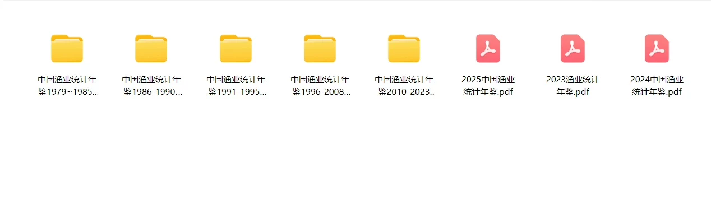
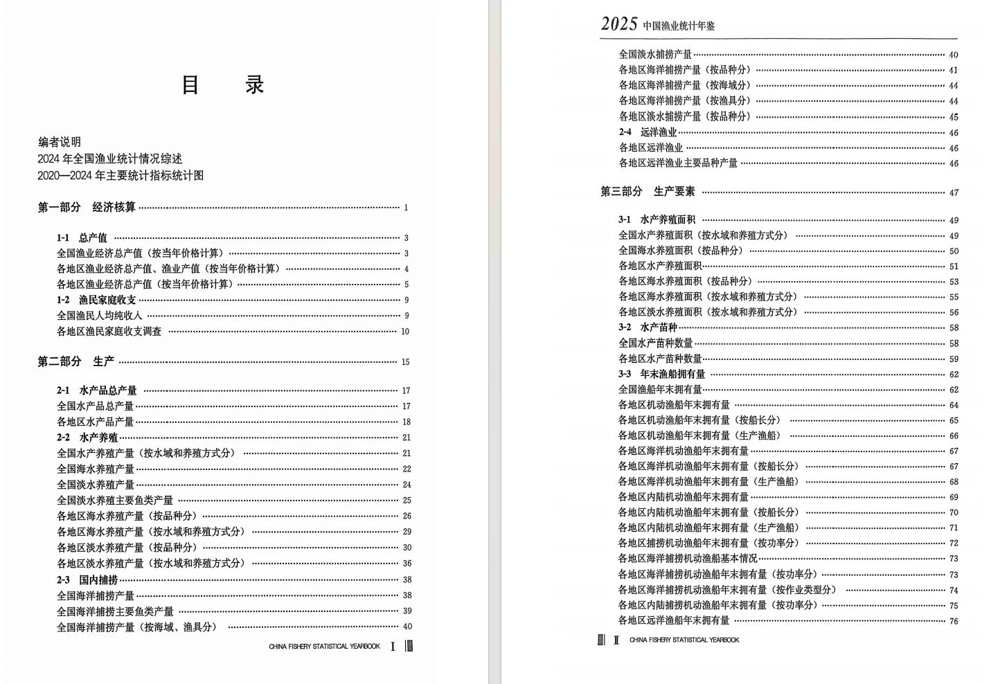
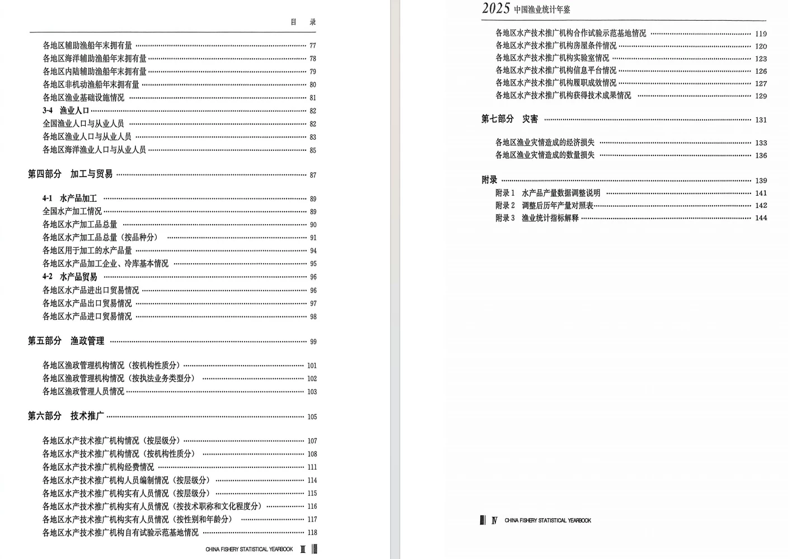

## Body

"China Fisheries Statistical Yearbook" (1979-2025)

Data Year: The yearbook covers the years from 1979 to 2025. (The data year is one less than the yearbook year.)

01. Data Introduction
"China Fisheries Statistical Yearbook"

02. Index Details
The directory is displayed in the picture, please take a look and purchase as per your needs. There are many indicators, so if you can't find them for me, I'm here. After shipping, we do not support return without reason.
The display directory is for 2025, and the statistical methods may change from year to year. Academic knowledge, the data yearbook records is the previous year's data, which is also academic knowledge, hope everyone understands.

03. Data Content
Format: All are PDF files. In 2022 and 2023, there were converted into Excel (machine conversion has not been checked, please refer to the PDF). Please read carefully before purchasing, those who are sensitive to format should not buy.

## Images

item_1072576552538

Here is a pay link on Stripe ( https://buy.stripe.com/3cs8yP7sY87d0vu9AB ). Please contact me lonlonago@foxmail.com after funding $89, and I will send you a complete data files , thank you!

